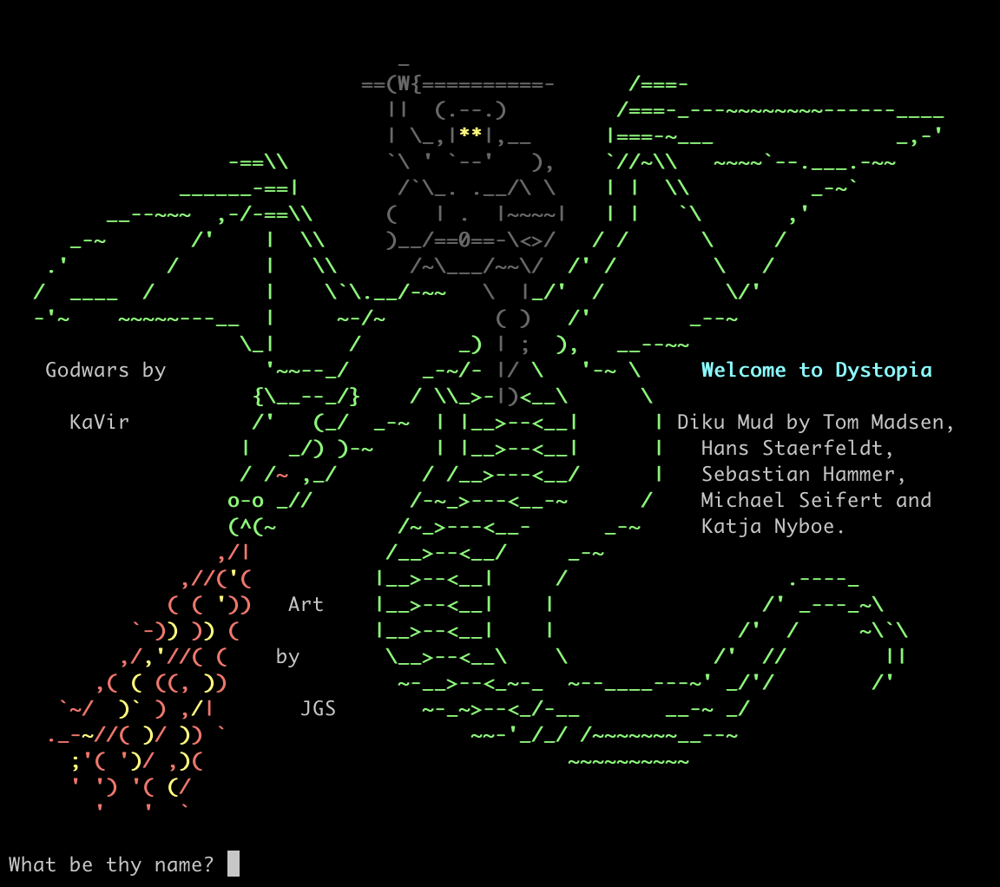
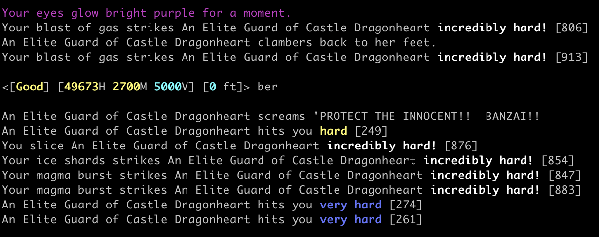
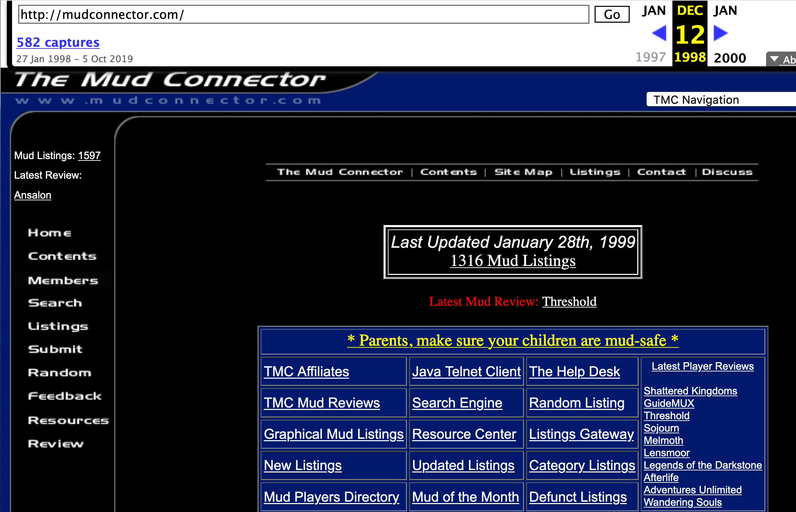

<Seo title="About MudMuseum" />

# About MudMuseum

MudMuseum was a concept born out of a work sabbatical. While enjoying time off to rest and focus on health and 
fitness, a need for maintaining and expanding my technical skills grew. The MudMuseum was something I've always 
wanted but never articulated conceptually. _Nostalgia_ for the thousands of lost hours in **Rom**, **Circle**, 
and **GodWars** MUDs, as a player and as an owner, has grown into a need to share this rich history with others. 

To that end, MudMuseum was born.

## My History with MUDs

Starting out on a Circle MUD named Alternate Illusions in 1997, I rolled a Warrior and died. _Cyclops_, my hardy
Warrior trudged on through the vast city of Midgaard. Over months, he grew in level, and somewhere in the mid
thirties, I rolled a Mage, _JuanJr_. I wish I knew the backstory behind the name, perhaps I rolled Juan and died
out of the gate, but in either case, JuanJr began his career throwing Fireballs. 

As the MUD loosened its rules and allowed multiplaying, I rolled a Cleric, Ninja, and several other classes 
creating a strong trio of characters to venture out into the world. There were ten minute long battles against
named boss-enemies from pop-culture and historical themes. Roman and Greek Gods, Looney Toons characters, and
Marvel X-Men mutants all became fun adventures for loot and challenges.

I soon moved on to several GodWars muds nearing the end of the 90s; _Shadow Wars_, _The Gathering_, and _Dystopia_ 
were some of the muds which stood out. A Werewolf named _Fang_, a Demon named _Brock_, and a variety-of-classes named 
_Ailen_, I enjoyed the GodWars MUD genre training, venturing, questing, and killing players. This was during my
early teens and became a focal point for my maturity (or lack thereof!)

Some time between 1998 and 2001, I ventured into a GodWars MUD called _Battle of the Immortals_. This would end up
being the primary codebase that I used moving forward, having been a part of the development team before the MUD
shut down. It was also one of the best, most fun MUDs I'd ever played, with an all-star cast of developers working
to build a beautiful world to venture into.

Outside of the MUDs themselves, I spent untold hours debating and enjoying conversation on The MudConnector (TMC) 
forums. This was one of the biggest online MUD resources during the late 90s and early 2000s, hosting public 
codebases, offering listings of hundreds if not thousands of (in)active muds, forums, and more. 

Over my time spent playing MUDs, I've made hundreds of friends and enemies and it would be a disservice to forget 
mentioning anyone. So I'll just leave my thoughts at offering my deepest gratitude to everyone who played, and my
sincere wishes that they have had a fantastic life after MUDs.